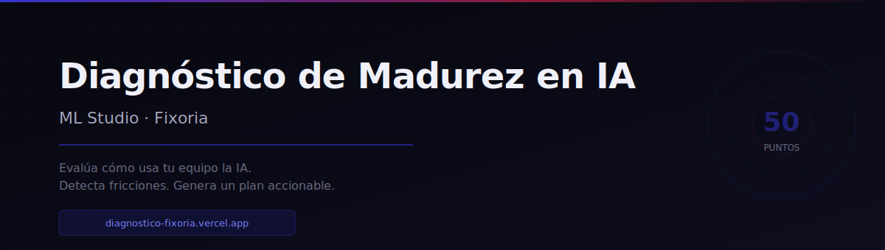
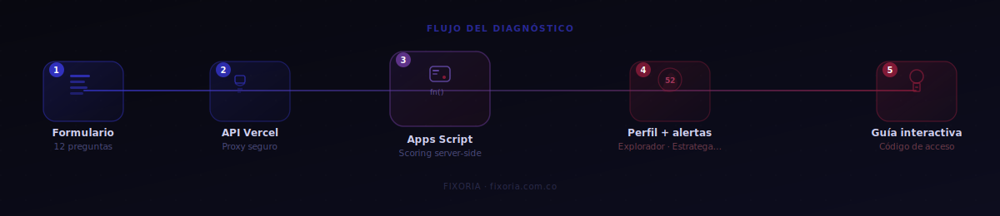

# Diagnóstico de Madurez en IA


Herramienta de diagnóstico estratégico que evalúa el nivel de madurez en IA de cada persona dentro de un equipo de trabajo. En 12 preguntas detecta fricciones reales, adopción de herramientas internas y oportunidades de automatización — y genera un perfil accionable con recomendaciones priorizadas.

---

## Qué mide

| Dimensión | Foco |
|---|---|
| Frecuencia y uso | Con qué regularidad y para qué usan la IA |
| Fricciones | Dónde están los bloqueos reales, no los percibidos |
| Adopción interna | Si los GPTs y automatizaciones del equipo están siendo usados |
| Impacto potencial | Qué automatizaciones tienen mayor retorno inmediato |

Al finalizar, el participante recibe un **perfil personal** (Explorador, Operativo, Optimizador o Estratega) con alertas concretas, un plan de recomendaciones y un **código de acceso** para recuperar sus resultados desde la guía interactiva.

---

## Flujo



Formulario (12 pasos) → proxy seguro Vercel → scoring server-side en Apps Script → perfil + alertas + recomendaciones → código de acceso → guía interactiva personalizada.

---

## Acceso

| Página | URL |
|---|---|
| Diagnóstico | [diagnostico-fixoria.vercel.app](https://diagnostico-fixoria.vercel.app) |
| Guía interactiva | [diagnostico-fixoria.vercel.app/guia.html](https://diagnostico-fixoria.vercel.app/guia.html) |

> El dashboard del facilitador requiere credenciales de acceso.

---

## Stack

| Capa | Tecnología |
|---|---|
| Frontend | HTML5, CSS3, JavaScript (vanilla) |
| Gráficas | Chart.js 4.4 |
| Backend / datos | Google Apps Script + Google Sheets |
| API proxy | Vercel Serverless Functions (Node.js) |
| Auth | HMAC-SHA256 stateless tokens |
| Hosting | Vercel |
| Tipografía | DM Sans, DM Serif Display |

---

## Arquitectura de seguridad

Las credenciales del dashboard nunca se exponen en el HTML público. El flujo de autenticación es:

```
facilitador.html
  → POST /api/login   (valida contra variables de entorno de Vercel)
    → token HMAC-SHA256
      → GET /api/proxy?action=data   (agrega FACILITATOR_KEY server-side)
        → Google Apps Script
```

Variables de entorno requeridas: `APPS_SCRIPT_URL`, `FACILITATOR_KEY`, `LOGIN_USER`, `LOGIN_PASS`, `VALID_KEY`, `SESSION_SECRET`. Ver `.env.example` para referencia.

---

## Google Apps Script

El proyecto usa dos archivos `.gs` en el mismo proyecto de GAS:

| Archivo | Contenido |
|---|---|
| `code.gs` | Handlers HTTP: `doPost()`, `doGet()` — pegar `appscript actual.txt` |
| `scoring.gs` | Motor de scoring server-side — pegar `appscript scoring.gs.txt` |

---

## Desarrollado por Fixoria

**[Fixoria](https://fixoria.com.co)** es una consultora colombiana especializada en la adopción de IA en equipos de trabajo. Acompañamos a empresas medianas con procesos concretos y resultados medibles — sin hype, con implementación real.

Este diagnóstico es parte del proceso de asesoría para ML Studio. No es un producto independiente — es la primera conversación.

[fixoria.com.co](https://fixoria.com.co)
