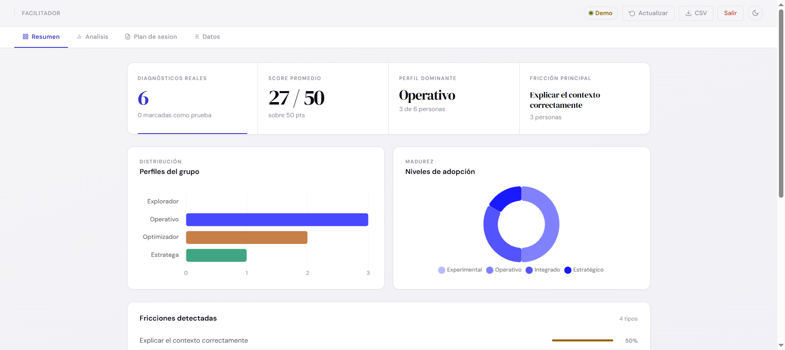



# AI Maturity Diagnostic

[](https://diagnostico-fixoria.vercel.app)
[](#)
[](#)
[](#)
[](#)

Strategic assessment tool that evaluates the AI maturity level of each person within a work team. In 12 questions it detects real friction points, internal tool adoption and automation opportunities — and generates an actionable profile with prioritized recommendations.

---

## What it measures

| Dimension | Focus |
|---|---|
| Frequency and usage | How regularly and for what tasks they use AI |
| Friction points | Where the real blockers are, not the perceived ones |
| Internal tool adoption | Whether the team's automations are actually being used |
| Potential impact | Which automations have the highest immediate return |

Participants receive a **personal profile** (Explorer / Operational / Optimizer / Strategist) with concrete alerts, a recommendations plan and an **access code** to retrieve results from the interactive guide.

---

## Flow


Form (12 steps) > secure Vercel proxy > server-side scoring in Apps Script > profile + alerts + recommendations > access code > interactive guide.

---

## Access

| Page | URL |
|---|---|
| Diagnostic | [diagnostico-fixoria.vercel.app](https://diagnostico-fixoria.vercel.app) |
| Interactive guide | [diagnostico-fixoria.vercel.app/guia.html](https://diagnostico-fixoria.vercel.app/guia.html) |

The facilitator dashboard requires access credentials.

## Facilitator dashboard



---

## Stack

| Layer | Technology |
|---|---|
| Frontend | HTML5, CSS3, vanilla JavaScript |
| Charts | Chart.js 4.4 |
| Backend / data | Google Apps Script + Google Sheets |
| API proxy | Vercel Serverless Functions (Node.js) |
| Auth | HMAC-SHA256 stateless tokens |
| Hosting | Vercel |
| Typography | DM Sans, DM Serif Display |

---

## Security architecture

Dashboard credentials are never exposed in public HTML. Auth flow:

```
facilitador.html
  POST /api/login  (validates against Vercel env vars)
    HMAC-SHA256 token
      GET /api/proxy?action=data  (appends FACILITATOR_KEY server-side)
        Google Apps Script
```

Required env vars: `APPS_SCRIPT_URL`, `FACILITATOR_KEY`, `LOGIN_USER`, `LOGIN_PASS`, `VALID_KEY`, `SESSION_SECRET`.

---

## Google Apps Script

Two `.gs` files in the same GAS project:

| File | Contents |
|---|---|
| `code.gs` | HTTP handlers: `doPost()`, `doGet()` |
| `scoring.gs` | Server-side scoring engine |

---

*Designed for Spanish-speaking teams in Colombia. Interface and reports are in Spanish.*

Built by **[Fixoria](https://fixoria.com.co)**